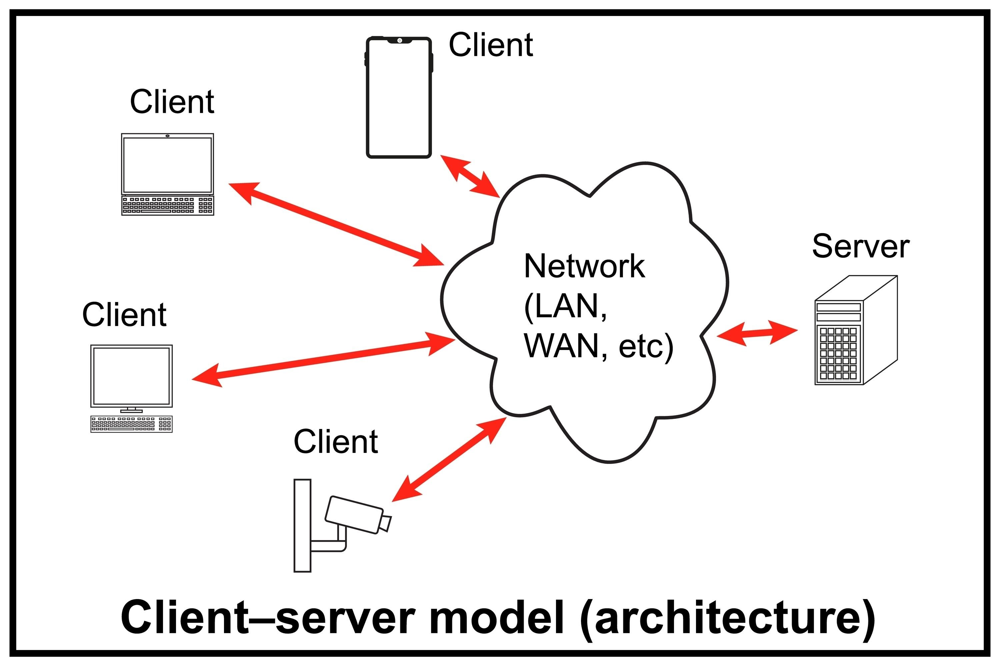

## Objectives
- What is Backend Development?
- Introduction to Flask
- Creating Our First Flask Application
- Working with Routes, Parameters, and URL Arguments
## What is Backend Development?
When we interact with a website or a mobile app, we only see the front-end the buttons, text, and images displayed on our screen. But behind the scenes, there's a whole other world working to make that experience possible. This is the backend, also known as the server-side.  
Backend development is the work that goes on behind the scenes. It's responsible for everything the user doesn't see, such as:  
1. **Storing and Managing Data**: When we create a user account or post a photo, the backend saves that information in a database.
2. **Handling Business Logic**: It processes our requests, performs calculations, and enforces the rules of the application. For example, it checks if our password is correct when we try to log in.
3. **Communicating with the Front-End**: The backend receives requests from our browser (the client) and sends back the data needed to display the webpage.
4. **Authentication and Security**: It manages user sessions and protects sensitive data from unauthorized access.


Essentially, if the front-end is the part of the restaurant where we sit and eat, the backend is the kitchen where the food is prepared, cooked, and made ready to serve. We, as backend developers, are the chefs.


## Introduction to Flask
Flask is a **microframework** for web development in Python. But what does "microframework" mean?
- **Framework**: It provides us with a set of tools and a structure to build web applications without having to start from scratch. It handles the low-level details of web communication (like processing HTTP requests) so we can focus on our application's logic.
- **Micro**: This means Flask is lightweight and provides only the essential components for building a web application. It doesn't force us into a specific way of doing things or include tools we might not need (like a database layer or a form validation library). It's simple, flexible, and easy to learn.

We choose Flask when we want to start small, move fast, and have the freedom to select our own tools and libraries as our application grows.
### The Blueprint-Based Architecture in Flask
Flask’s architecture revolves around a blueprint-based modular system, which organizes code into reusable components called blueprints and leverages extensions to add functionality. This design enhances modularity, maintainability, and scalability, while keeping the core framework lightweight and flexible. Let’s break down its core components:

#### Blueprints
Blueprints are self-contained modules that encapsulate specific functionality, such as authentication, user management, or API routes. Each blueprint can define its own routes, templates, static files, and error handlers, keeping the application organized and focused.  
For example, a `users` blueprint can handle all `/users/*` routes, while a separate `products` blueprint manages `/products/*` endpoints.

#### Encapsulation
Each blueprint operates within its own namespace, avoiding conflicts between different parts of the application. This means that routes, templates, or static files in one blueprint won’t interfere with another unless explicitly shared.  
Blueprints can be easily registered or removed, giving developers fine-grained control over application structure.

#### Extensions
Flask relies on extensions to provide advanced capabilities like database management, authentication, or form handling. These extensions integrate seamlessly with the Flask core while remaining optional.  
Popular extensions include:

- `Flask-SQLAlchemy` for database ORM
- `Flask-Login` for user sessions and authentication
- `Flask-Migrate` for database migrations
    

This approach allows Flask to remain minimal at its core but powerful when extended. 


#### Request Lifecycle
Flask provides **request hooks** (`before_request`, `after_request`, `teardown_request`) that allow blueprints or extensions to interact with the request-response lifecycle.  
These hooks make it easy to add custom logic such as logging, authentication checks, or request preprocessing.  
**Typical lifecycle:**
```
before_request → view function → after_request → teardown_request
```
### Structure of a Flask App
For a simple Flask application, our project structure can be very minimal. All we need is a virtual environment to manage our packages and a single Python file to write our code.  
Our initial structure will look like this:
```
my_flask_project/
├── venv/            # Our virtual environment folder
└── app.py           # Our main Flask application file
```
## Creating Our First Flask App
Let's build our first application. This will teach us how to set up our environment, install Flask, and create a simple web server.
### Setting Up the Environment
First, we need to create an isolated environment for our project. This prevents conflicts between packages from different projects. We use a tool called `venv`.    
Open your terminal, navigate to your project directory, and run:

**For macOS/Linux**  
We create our virtual environment using:  
```shell
python3 -m venv venv
```
Then we activate it with
```shell
source venv/bin/activate
```
**For Windows**  
We create the virtual environment with
```shell
python -m venv venv
```
Then we activate it using
```shell
.\venv\Scripts\activate
```
We'll see `(venv)` appear at the beginning of our terminal prompt, which confirms our virtual environment is active.
### Installing Flask
Now, with our environment active, we can install Flask using `pip`, Python's package manager.
```shell
pip install Flask
```
### Creating the "Hello, World!" App
Now that Flask is installed, let’s build our very first application. This simple example will demonstrate the basic structure of a Flask app and show how we can serve a response from the server to a web browser.  
The first step is to create a new file in your project directory called `app.py`. This file will contain the main logic of our application.  
Open it in your code editor and add the following code:  
**`app.py`**
```python
from flask import Flask

app = Flask(__name__)

@app.route('/')
def home_page():
    return "Hello, World!"

if __name__ == '__main__':
    app.run(port=3000, debug=True)
```
In Flask, everything begins with the `Flask` class, which serves as the foundation of any web application. We start by importing it from the `flask` package and then creating an instance of it: `app = Flask(__name__)`. This `app` object represents our web application, and it’s responsible for handling requests, managing routes, and returning responses. The argument `__name__` is a special Python variable that holds the name of the current module. Flask uses it to determine the location of the application so it can correctly find resources such as templates and static files.

After initializing the app, we define how it should respond to web requests by using the `@app.route('/')` decorator. A decorator in Python modifies the behavior of a function in this case, it tells Flask that when a user visits a specific URL (known as a **route**), the associated function should run. The argument `'/'` represents the root path of the website, which is what users reach when they visit your site’s homepage. When someone visits this route, Flask executes the `home_page()` function and sends back its return value—here, the text `"Hello, World!"`—as the response displayed in the browser.

At the bottom, the `if __name__ == '__main__':` condition acts as a safeguard. It ensures that the web server starts only when this script is run directly, not when it’s imported as a module into another Python file. This is important because importing should not unintentionally start the server. Inside that block, `app.run(port=3000, debug=True)` launches the Flask development server, making your app accessible locally through `http://localhost:3000`. The `debug=True` argument enables helpful developer features, it automatically reloads the server whenever we make code changes and provides detailed error messages if something goes wrong.  
Now we run our application using
```shell
python app.py
```
Our terminal will show an output indicating the server is running, usually at `http://127.0.0.1:3000/`. If we open this URL in our web browser, we will see the text "Hello, World!". We've just created our first web server! 

## Working with Parameters and Arguments
Static pages are great, but most applications need to handle dynamic data. Flask makes it easy to capture information directly from the URL.
### URL Parameters (Dynamic Routes)
Sometimes, we want to capture a part of the URL as a variable. For example, to show a user's profile page. We can do this by adding variable sections to our route.  
Let's create new app, this time it greet the user depending on their username:  
**`app.py`**
```python
from flask import Flask

app = Flask(__name__)

@app.route('/user/<username>')
def greet_user(username):
    return f"Hello, {username}"

if __name__ == '__main__':
    app.run(port=3000, debug=True)
```
Here, the route `'/user/<username>'` defines a **variable section** in the URL using angle brackets (`< >`). The placeholder `<username>` tells Flask to capture whatever value appears in that part of the URL and pass it as an argument to the function `greet_user()`. For example, if a user visits `http://localhost:3000/user/alice`, Flask matches this route pattern and automatically extracts the word `alice` from the URL. It then calls the function as if we had written `greet_user("alice")`.

Inside the function, we can use this captured value just like a regular variable. In this case, `username` holds the value `"alice"`, and the function returns a personalized message: `"Hello, alice"`. 
### URL Query Arguments
Another way to pass data is through query arguments, which are key-value pairs added to the end of a URL after a `?`. For example: `/search?query=flask`.  
To access these, we need to import the `request` object from Flask. The `request.args` attribute gives us a dictionary-like object containing all the query arguments.   
Let's create a new app that uses query arguments:  
**`app.py`**
```python
from flask import Flask,request

app = Flask(__name__)

@app.route('/search')
def greet_user():
    query_param = request.args.get('query')
    if query_param:
        return f'You are searching for: {query_param}'
    else:
        return 'Please provide a search query.'

if __name__ == '__main__':
    app.run(port=3000, debug=True)
```
Here the route `/search` defines a fixed endpoint, meaning the URL path itself doesn’t change instead, the information is passed through query parameters. Flask provides the `request` object to access data sent by the client, and `request.args` specifically handles query parameters from the URL.

When a user visits a URL like `http://localhost:3000/search?query=flask`, the part after the question mark (`?query=flask`) is a query string. Flask reads this and stores it in `request.args`, which behaves like a dictionary. By calling `request.args.get('query')`, we retrieve the value associated with the key `'query'`, in this case, `"flask"`.

The code then checks if a query parameter was provided. If it exists, the app responds with `"You are searching for: flask"`. If the user visits the same route without a query (for example, `http://localhost:3000/search`), then `query_param` will be `None`, and Flask returns the message `"Please provide a search query."`

We can also include multiple query parameters in a single URL by separating them with an ampersand (`&`). For example, visiting    `http://localhost:3000/search?query=flask&sort=recent&page=2`  
sends three parameters (`query`, `sort`, and `page`) that can all be accessed individually using `request.args.get('query')`, `request.args.get('sort')`, and `request.args.get('page')`.
## Building a Simple JSON API
Now, let's combine everything we've learned to build a simple API that returns a JSON object. APIs are how modern applications communicate. Instead of returning text, we will return data that another application (like a mobile app or a JavaScript front-end) can easily use.  
Our goal is to create an endpoint that:
1. Accepts a product `id` as a URL parameter.
2. Accepts an optional `currency` as a query argument.
3. Returns a JSON object with the product details.

First, we add `jsonify` to our imports. This is a Flask function that correctly formats our Python dictionaries into JSON responses.
```python
from flask import Flask, request, jsonify
products_db = {
    "100": {"name": "Laptop", "price": 1200},
    "101": {"name": "Mouse", "price": 25},
    "102": {"name": "Keyboard", "price": 75}
}

app = Flask(__name__)

@app.route('/api/products/<product_id>')
def get_product(product_id):
    product = products_db.get(product_id)
    if not product:
        return jsonify({"error": "Product not found"}), 404
        
    currency = request.args.get('currency', 'USD')

    response_data = {
        "id": product_id,
        "name": product["name"],
        "price": product["price"],
        "currency": currency
    }
    return jsonify(response_data)


if __name__ == "__main__" :
    app.run(port=3000,debug=True)
```
After adding this code, run the app and try visiting these URLs in your browser:
- `http://127.0.0.1:3000/api/products/101`
- `http://127.0.0.1:3000/api/products/101?currency=EUR`
- `http://127.0.0.1:3000/api/products/999` (to see the error message)

We'll see a clean JSON output directly in the browser.
## Tasks
### Task 1: Build a Basic User Profile API (Flask)

Create a Flask app and define a route ``/profile/<username>`` that:
- Returns a **JSON object** with a user profile .        
- Accepts an **optional query parameter** `details`:
    - If `details=true`, return extended user information.        
    - Otherwise, return only basic user info.

**Example Output:**
- Visiting `http://localhost:3000/profile/Alice` should return:
```
`{ "username": "Alice" }`
```
- Visiting `http://localhost:3000/profile/Alice?details=true` should return:
```
{ "username": "Alice", "email": "alice@example.com", "role": "admin" }
```
### Task 2: Book Information API
Create new Flask app  that:
- Returns book details based on the **URL parameter** `book_id`.    
- Accepts an optional **query parameter** `summary`:
    - If `summary=true`, return only the book’s title and author.
            
    - Otherwise, return the full details, including title, author, and price.
    
**Example Output:**

- Visiting `http://localhost:3000/books/201` should return:
```
{ "id": "201", "title": "Clean Code", "author": "Robert C. Martin", "price": 35 }
```
- Visiting `http://localhost:3000/books/201?summary=true` should return:
```
{ "title": "Clean Code", "author": "Robert C. Martin" }
```